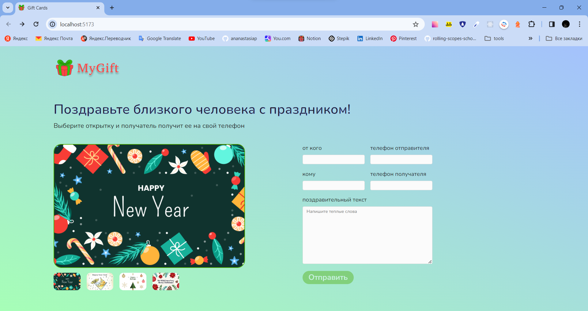
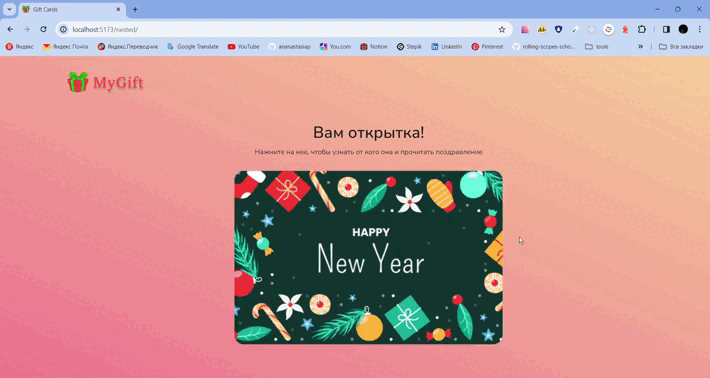

# gift-cards


## Описание

Отправка открыток с посланием.
<br>
Выбираем картиночку => заполняем информацию => генерируется ссылка => переходим по ней

## Установка и запуск

```
yarn

yarn dev
```

## Сервер

В папке my-gift-api:

```
npm i
```

или

```
yarn
```

### запуск

```
node index
```

Вместо локального сервера можно использовать, например, [Glitch](https://glitch.com/).
<br>
Из-за того, что всё происходит локально, ссылку нельзя отправить на другое устройство. С другого устройства, на котором не включён сервер, также нельзя отправить данные.

## Предпросмотр




